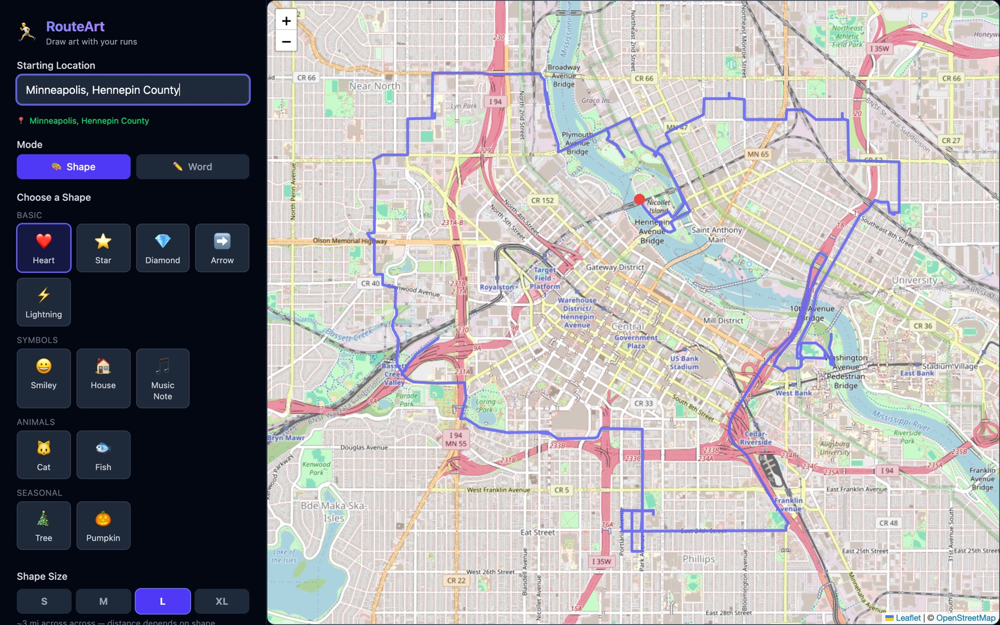
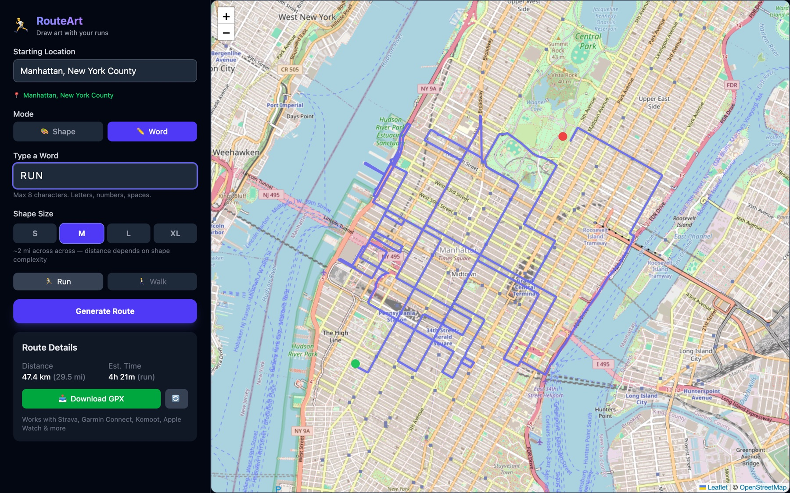

# RouteArt

**[Live App](https://route-art-nine.vercel.app/)** · Generate running routes shaped like images, symbols, or words

> **Status: work in progress.** The app runs end to end — geocode a city, pick a shape, generate a route, export GPX to Strava or Garmin. But the shapes don't yet come out recognizable on real street networks. The [open problem](#the-open-problem-shape-fidelity) below is the interesting part of this project and the thing I intend to come back to.

Pick a city, choose a shape (or type a word), and RouteArt maps it onto real walkable streets and hands you a GPX file. The pipeline works. The output isn't art yet.

## How it works

1. **Geocode** the starting location via Nominatim
2. **Project** the shape's normalized `[0..1]` vertices onto lat/lng around that center, scaled to the requested size
3. **Route** each consecutive pair of vertices through OSRM's walking profile
4. **Stitch** the returned polylines into one continuous path and export as GPX

```
src/lib/
├── shapes.ts    # Shapes as normalized [x,y] vertex lists (heart is 16 parametric points)
├── letters.ts   # Letter/word → vertex paths for word mode
├── routing.ts   # Projection to lat/lng, OSRM segment routing, polyline6 decoding
└── gpx.ts       # GPX serialization
```

## The open problem: shape fidelity

**What happens:** a heart generated over Minneapolis at size L returns a valid, runnable 20-mile route that does not look like a heart. The same is true of word mode — "RUN" over Manhattan produces a tangle, not letters.

**Why.** The current design routes only between the shape's *corner vertices* and lets OSRM path-find between them — an explicit decision, documented at the top of `shapes.ts`:

```
// IMPORTANT: Only include corner points and curve control points.
// Do NOT interpolate along straight lines — OSRM handles path-finding between points.
```

That's the bug, and it's a design bug rather than a coding one. **OSRM returns the *shortest* path between two points, which is unconstrained by the straight line connecting them.** With a 16-point heart scaled to ~3 miles across, consecutive waypoints sit roughly **1 km apart** — and over 1 km of city streets, the shortest walkable path can deviate arbitrarily far from the intended edge. Only the 16 vertices land where the shape wants them; every segment between them is an arbitrary street wander.

The distortion is measurable: that heart has an intended perimeter of roughly 10 miles, and the generated route is **20 miles**. The 2× overshoot *is* the wandering.

**What I'd try next.** Densify before routing rather than after — interpolate each shape edge into waypoints every ~100–200 m, so each OSRM call spans a short enough distance that the shortest path can't meaningfully deviate from the intended line. The constraint this runs into is request volume: a densified heart is hundreds of segments instead of 16, and the public OSRM demo server (`router.project-osrm.org`) is rate-limited and explicitly not intended for production use. Doing this properly likely means one of:

- Self-hosting OSRM, or using its `/match` (map-matching) service, which is designed for exactly this — snapping a dense synthetic trace to the road network as a whole rather than routing point-to-point
- Pulling the local street graph once (Overpass API) and running the shape-fitting search locally, which turns this into a graph problem — find the cycle in the street graph that minimizes Fréchet or Hausdorff distance to the target polygon
- Scoring candidate routes against the intended shape and searching over placements/rotations, instead of accepting the first result

The second option is the one I find most interesting, and it's the direction I'd take it: it reframes "draw a heart with your run" from an API-stitching exercise into an actual shape-matching problem over a graph.

## Current output



*Size L heart centered on Minneapolis: 32.2 km, valid and runnable, not a heart. The vertices are in the right places; everything between them is shortest-path wander.*



*Word mode, "RUN" over Manhattan, same root cause.*

## What works

- **Geocoding + autocomplete** — Nominatim search with suggestion list
- **Shape library and word mode** — 12 shapes plus arbitrary short words via `letters.ts`
- **Real street routing** — OSRM walking profile, segment-batched 6 at a time to respect rate limits
- **GPX export** — imports cleanly into Strava, Garmin Connect, Komoot, Apple Watch
- **Distance and time estimates** — computed from the actual returned route, not the intended shape
- **Responsive layout**

## Tech stack

React, TypeScript, Vite, Tailwind CSS, Leaflet (maps), OSRM (routing), Nominatim (geocoding).

## Running locally

```bash
npm install
npm run dev
```

Open [http://localhost:5173](http://localhost:5173). No API keys or database — it uses free public OpenStreetMap services.

## Other known limitations

- **Public OSRM demo server.** No SLA, rate-limited, and not meant for production traffic. Any serious version self-hosts.
- **Geocoder picks the first plausible match.** Searching "Chicago" can center on an outlying township rather than the Loop, which puts the shape somewhere unintended.
- **No route validation.** The app accepts whatever OSRM returns; it never checks the result against the shape it was asked for. Adding that check is a prerequisite for fixing fidelity — you can't improve what you don't measure.
